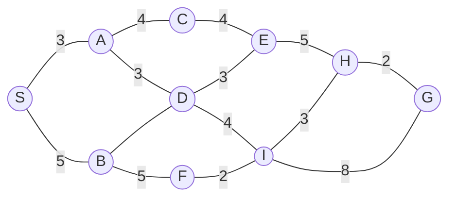

# 25-26 海洋人工智能基础 回忆卷

[点击下载 PDF 版](./assets/海人基回忆.pdf){ .md-button .md-button--primary }

## 贡献者署名

- 回忆整理：
- PDF / 排版：
- 校对：

## **一、**（10分）

$b\in\{1,-1\}$，$P(b=1)=0.7$，$P(b=-1)=0.3$，有

$$
y=b+w,\quad w\sim N(0,\sigma^2)
$$

（1）$y=0.5$，求 $p(y)$（5分）

（2）求 $P(b=1\mid y)$ 和 $P(b=-1\mid y)$（5分）

## **二、**（10分）

$(x,y)\sim N$，均值为

$$
\mu=
\begin{bmatrix}
1\\
-1
\end{bmatrix}
$$

协方差矩阵为

$$
\Sigma=
\begin{bmatrix}
1 & 3\\
3 & 25
\end{bmatrix}
$$

（1）求 $p(x)$，$p(y)$（5分）

（2）求$p(x\mid y)$、$p(y\mid x)$、后验均值和后验方差（5分）

## **三、**（13分）

（1）证明

$$
\alpha\to\beta \equiv \neg\alpha\vee\beta
$$

（2）$\operatorname{plane}(x)$ 表示 $x$ 是飞机，$\operatorname{in\_ground}(x)$ 表示飞机在陆地上，$\operatorname{on\_fly}(x)$ 表示飞机在空中。 符号化以下内容：

飞机要么在陆地上，要么在空中；不是所有飞机都在空中；推出有飞机在陆地上。

## **四、**（15分）

搜索：给了一个路径图和启发函数。

启发函数表记不住 

（1）写出从S到G所有路径和代价，给出最佳路径。

（2）使用贪婪优先算法写出路径和代价。

（3）使用 $A^{*}$ 算法写出路径和代价。

（4）对比上述两个算法。

## **五、**（10分）

有一系列样本点 $(x_i,y_i)$，线性回归的目的是找到参数 $a,b$，使

$$
y\approx ax+b
$$

（1）写出优化 $a$ 和 $b$ 的损失函数，并写出几何意义。（5分）

（2）用线性代数的知识写出 $a$ 和 $b$ 的最优解，可以用矩阵表示。（5分）

## **六、**（5分）

支持向量机里，超平面为

$$
w^T X+b=0
$$

（1）证明 $w$ 是超平面的法向量。（2分）

（2）求 $X_0$ 到超平面的距离。（3分）

## **七、**（14分）

$K$-means 算法，点为

$$
A(0,0),\quad B(0,2),\quad C(3,1),\quad D(6,6),\quad E(6,8),\quad F(9,7)
$$

可以使用欧氏距离的平方进行判断。

（1）选取 $A$ 点和与 $A$ 距离最远的点作为初始化质心，用欧氏距离计算哪个是初始化质心。

（2）进行第一轮迭代，给出第一轮分类结果。

（3）根据第一轮分类更新质心。

（4）进行第二轮迭代并判断是否收敛。

（5）说明为什么需要取合适的初始质心，如果初始质心在同一区域会怎么样。

## **八、**（3分）

前面给了一段背景材料，从几个名词里选出 $3$ 个适合作为智能体的感知器的东西。

从四个选项里选出水域巡查智能体的合适执行方式。

## **九、**（10分）

$d_k=2$，

$$
q=
\begin{bmatrix}
2 & 0
\end{bmatrix},
\quad
k_1=
\begin{bmatrix}
2 & 2
\end{bmatrix},
\quad
k_2=
\begin{bmatrix}
0 & 2
\end{bmatrix}
$$

（1）使用点积公式 $qk$ 求出 $e_{1,1}$，$e_{1,2}$。

（2）使用 $d$ 进行缩放：

$$
\frac{e_{1,i}}{\sqrt{d_k}}
$$

（3）使用 softmax 公式归一化：

$$
\operatorname{softmax}(x_i)
=
\frac{e^{x_i}}{\sum_j e^{x_j}}
$$

## **十、**（10分）

（1）对比带动量的随机梯度下降，即 SGD with Momentum，和 Adam。  

为什么 Adam 是“安全默认”选择？  

什么时候人们还是更倾向于带动量的随机梯度下降？ 

（2）解释批量归一化的技术机制，它如何帮助减少“内部协变量偏移”并稳定训练过程？
