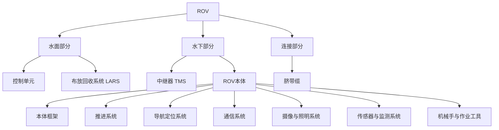
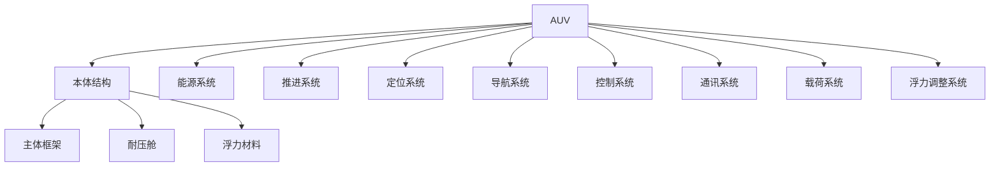
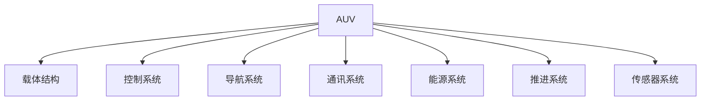
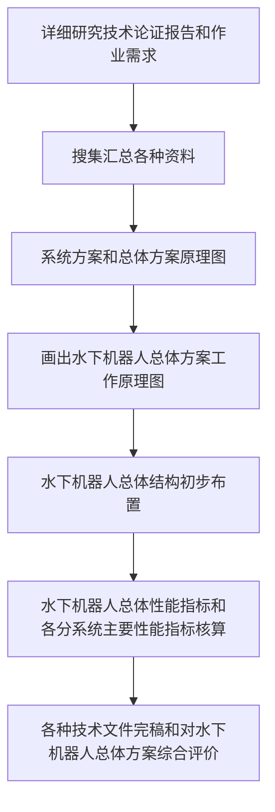
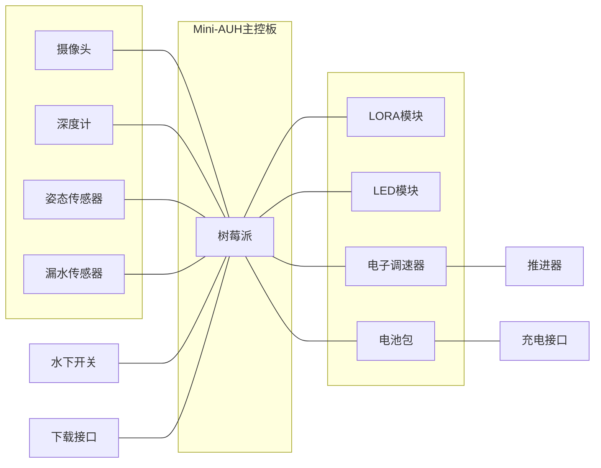

# 总体设计

!!! note
    PPT 内容比较多，这里把大部分内容都放上来了，应该是以了解为主。

## 课程主要内容

```text
水下机器人总体设计流程
 - 竞赛用水下机器人总体设计
水下机器人设计案例
 - AUH 总体设计
 - AUV 总体设计
 - ROV 总体设计
```

## 两种机器人的组成

### ROV 组成


LARS: Launch and recovery system
TMS: Tether Management System

### AUV 组成



### AUV 功能模块



## 总体设计方法

- Q：总体设计是什么？
- A：基于系统性、全局性视角的方案设计，从复杂笼统的原始需求中制定设计指标，依据设计指标完成初步设计方案。

- Q：为什么要总体设计？
- A：总体设计能以系统化视角，将复杂的大问题拆分成多个不同的小问题，进而合理地分配给各项目组成员，降低问题解决难度。

## 总体方案设计程序与内容

### 水下机器人总体方案设计程序：



### 总体技术指标

水下机器人主要**总体参数**通常包括：

1. 结构形式
2. 控制方式
3. 尺寸
4. 重量
5. 最大作业水深
6. 最大航速
7. 航程或航行时间
8. 动力系统功率、转速
9. 推进方式
10. 作业需求（传感器）
11. 可靠性指标
12. ……

### 基本理论：系统工程原理和方法

主要内容：

(1) 作业需求（海洋环境）及其对水下机器人总体设计的要求和约束

(2) 确定水下机器人系统组成与配置

(3) 设计水下机器人外部构造、进行流体动力布局

(4) 设计水下机器人结构，进行总体布置和静力布局

(5) 总体和分系统之间，各分系统之间的协调和匹配

(6) 水下机器人综合性能分析和评估，包括运动特性、声学特性、可靠性、维修性、安全性等

(7) 优化设计

## 总体设计流程

总体设计流程分为8个部分，分别是：

1. 需求分析
2. 制定指标
3. 方案设计
4. 器件选型
5. 动力设计
6. 结构设计
7. 电气系统
8. 报告撰写

### 需求分析

#### 拿到题目

作业任务： 

- 完成巡线任务
- 完成标志物识别任务

（图片见PPT）

#### 拆分任务：

- 基础运动功能
    - 进退、转向、升沉
- 图像检测功能
    - 识别引导铝型材
    - 识别特定标志物
- 其他辅助功能

### 制定指标

| 序号 | 指标名称 | 设计参数 | 备注 |
|---|---|---|---|
| 1 | 尺寸大小 | ≤500mm | — |
| 2 | 重量控制 | ≤10kg | — |
| 3 | 续航时间 | ≥0.3h | — |
| 4 | 姿态精度 | ≤±5° | 欧拉角 |
| 5 | 最大速度 | 1节 | — |
| 6 | 深度精度 | ±50mm | — |
| 7 | 最大深度 | 10m | — |

补充说明：

- 课程或竞赛水下机器人一般小于5kg重量
- 不推荐使用大于1.5kg推力的推进器

### 方案设计



### 器件选型

- 传感器
  - 姿态传感器
  - 深度计
  - 水下摄像头
- 执行器
  - 水下推进器
  - 电子调速器
- 通讯模块
  - LoRa 模块
- 电源
- 机械器件
  - 耐压仓
  - 穿线螺栓
  - 水下开关
  - 航空插头
- 控制板
  - 主控板 - 运动控制
  - 算力板 - 图像识别（一般不用于运动控制）

#### 方案成熟度评估

- 方案成熟度：技术水平、工艺流程、配套生态、技术生命周期等项目可行程度的综合评价指标
- 影响方式：系统开发难易程度、系统兼容性、项目研发周期
- 最容易忽略的因素：==潜在风险==、稳定性（不推荐使用未经验证的潜在风险大的不成熟方案）

### 动力设计

推进器的布置主要探讨两个问题：

- 推进器的数量
- 推进器的位置

这两者决定了ROV的可能运动和运动性能。
